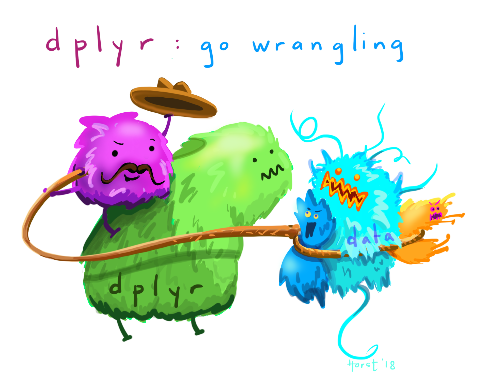

```{r setup, echo=FALSE, warning=FALSE, purl=FALSE, message=FALSE}
options(repos = "http://cran.rstudio.com/")
pkgs <- c("dplyr", "knitr")
x<-lapply(pkgs, library, character.only = TRUE)
opts_chunk$set(tidy = FALSE, message = F, warning = F)
```

## Lesson Outline

- [Goals and Motivation]
- [Data Wrangling with dplyr]
- [Joining datasets]

## Goals and Motivation

Data wrangling is the part of any data analysis that will take the most time. While it may not necessarily be fun, it is foundational to all the work that follows. Often, it also takes significantly longer than actually performing the data analysis or creating a data visualization, so do not panic if, in the future, you find yourself spending a lot of time on this single step. For the purpose of condensing today's lessons, we will be working with a fairly tidy dataset. But there are many online resources available to help you in your own work, should you be handed a project with a particularly gnarly dataset.

After this session you should be able answer the following:

* What are some basic wrangling functions from dplyr?
* How do I join different datasets?

## Data wrangling with dplyr


The data wrangling process includes data import, tidying, and transformation.  The process directly feeds into, and is not mutually exclusive with, the *understanding* or modelling side of data exploration.  More generally, data wrangling is the manipulation or combination of datasets for the purpose of analysis.  

**All wrangling is based on a purpose.**  No one wrangles for the sake of wrangling (usually), so the process always begins by answering the following two questions:

* What do my input data look like?
* What should my data look like given what I want to do?

At the most basic level, going from what your data looks like to what it should look like will require a few key operations.  Some common examples:

* Selecting specific variables
* Filtering observations by some criteria
* Adding or modifying existing variables
* Renaming variables
* Arranging rows by a variable
* Summarizing a variable conditional on others

The dplyr package provides easy tools for these common data manipulation tasks and is a core package from the [tidyverse](https://www.tidyverse.org/) suite of packages. The philosophy of dplyr is that **one** function does **one** thing and the name of the function says what it does. 

We'll start this lesson by working in the script we created in the previous section - cabw_script_day1.R.

Below your code that imports the dataset, create a new header by typing `#### Wrangling and Plotting ####`. You should notice how this now appears in an expandable table of contents on the right hand side of your script pane. This feature can be very helpful in keep your scripts organized.

Alright, let's get wrangling!



### Selecting

Our goal with the datasets we have loaded in is to combine the bioassessment scores by each unique location, date, and replicate, while keeping only the data we need for our plots. 

 The `select` function lets you retain or exclude columns.

```{r}
# first, select some chosen columns
dplyr_sel1 <- select(cscidat, SampleID_old, New_Lat, New_Long, CSCI)

# examine those columns
head(dplyr_sel1)

# select everything but CSCI and COMID - the "-" sign indicates "not"
dplyr_sel2 <- select(cscidat, -CSCI, -COMID)
head(dplyr_sel2)

# select columns that contain the letter c
dplyr_sel3 <- select(cscidat, matches('c'))
head(dplyr_sel3)

# Note, these datasets should all be appearing in your Environment pane in the upper right hand corner of your screen as you continue.
```

### Filtering

After selecting columns, you'll probably want to remove observations that don't fit some criteria.  For example, maybe you want to remove CSCI scores less than some threshold, find stations above a certain latitude, or both.

```{r}
# get CSCI scores greater than 0.79
dplyr_filt1 <- filter(cscidat, CSCI > 0.79)
head(dplyr_filt1)

# get CSCI scores above latitude 37N
dplyr_filt2 <- filter(cscidat, New_Lat > 37)
head(dplyr_filt2)

# use both filters
dplyr_filt3 <- filter(cscidat, CSCI > 0.79 & New_Lat > 37)
head(dplyr_filt3)

# You can use "&" to signify "and" and "|" to signify "or" in your wrangling statements.
```


Filtering can take a bit of time to master because there are several ways to tell R what you want. To use filtering effectively, you have to know how to select the observations that you want using the comparison operators. R provides the standard suite: `>`, `>=`, `<`, `<=`, `!=` (not equal), and `==` (equal). Remember to use `=` instead of `==` when testing for equality!


### Mutating

Now that we've seen how to select columns and filter observations of a data frame, maybe we want to add a new column. In dplyr, `mutate` allows us to add new columns. These can be vectors you are adding *or* based on expressions applied to existing columns. For instance, maybe we want to convert a numeric column into a categorical using certain criteria *or* maybe we want to make a new column based on some arithmetic on other columns.

```{r}
# get observed taxa
dplyr_mut1 <- mutate(cscidat, observed = OE * E)
head(dplyr_mut1)

# add a column for lo/hi csci scores
dplyr_mut2 <- mutate(cscidat, CSCIcat = ifelse(CSCI <= 0.79, 'lo', 'hi'))
head(dplyr_mut2)

# Note: "ifelse" statements can be very helpful for conditional assignments. Their basic structure is if *the criteria* is met, then print 'this', if not, then print 'that'.

# So, the actual statement may look something like:
# ifelse(*the criteria*, 'this', 'that')
```


### More functions

Some other useful dplyr functions include `arrange` to sort the observations (rows) by a column and `rename` to (you guessed it) rename a column.

```{r}
# arrange by CSCI scores
dplyr_arr <- arrange(cscidat, CSCI)
head(dplyr_arr)

# rename lat/lon (note the format of newName = oldName)
dplyr_rnm <- rename(cscidat, 
                    lat = New_Lat,
                    lon = New_Long
                    )
head(dplyr_rnm)
```

### Practice Exercise

Let's clean up our CSCI dataset in preparation to join with our ASCI dataset.  We'll select columns we want and rename those with odd names.

1. Select the unique sample ID column (`SampleID_old`), latitude (`New_Lat`), longitude (`New_Long`), and `CSCI` columns. Reassign these columns to a dataset named `cscidat`, effectively overwriting the existing dataset.

    ```{r}
cscidat <- select(cscidat, SampleID_old, New_Lat, New_Long, CSCI)    
    ```
    
1. Rename the `SampleID_old` column to `id`, `New_Lat` to `lat`, and `New_Long` to `lon`.

    ```{r}
cscidat <- rename(cscidat, 
                  id = SampleID_old, 
                  lat = New_Lat, 
                  lon = New_Long
                  )
    ```

## Joining datasets

Combining data is a common task of data wrangling.  All joins require that each of the tables can be linked by shared identifiers.  These are called 'keys' and are usually represented as a separate column that acts as a unique variable for the observations.  Our example datasets include the `id` column that represents a unique identifier as a combination of station, sample date, and replicate.

The challenge with joins is that the two datasets may not represent the same observations for a given key.  For example, you might have one table with all observations for every key, another with only some observations, or two tables with only a few shared keys.  What you get back from a join will depend on what's shared between tables, in addition to the type of join you use. 

For our data, we'll be using an **inner-join** that combines datasets by shared keys (for an overview of the other types of joins, see [here](http://r4ds.had.co.nz/relational-data.html#understanding-joins)).


### Practice Exercise cont.

We'll join our ASCI data to our CSCI data to make a single dataset that has scores for **both** bioassessment indices taken at the same place and time.  This will help us plot and map the data later. 

1. Before you start, check the dimensions of both datasets (e.g., `dim` or `nrow`).  How many rows in each?

    ```{r}
    dim(cscidat)
    dim(ascidat)
    ```
    
1. Using the `inner_join` function from dplyr, join `cscidat` with `ascidat` using the `id` column as the key.  

    ```{r}
    alldat <- inner_join(cscidat, ascidat, by = 'id')
    ```
    
1. Check the dimensions of the new dataset (i.e., how many unique bioassessment scores were collected at the same time and place).

1. Save your script!

This concludes the "wrangling data" section of our R workshop today. If you are experiencing any problems or have a question, please send Ryan, Heili, or one of the workshop assistants a message in the chat.

Here are some additional dplyr resources:

* [dplyr GitHub repo](https://github.com/hadley/dplyr)
* [CRAN page: vignettes here](http://cran.rstudio.com/web/packages/dplyr/)
* [Cheatsheet](https://www.rstudio.com/wp-content/uploads/2015/02/data-wrangling-cheatsheet.pdf)
