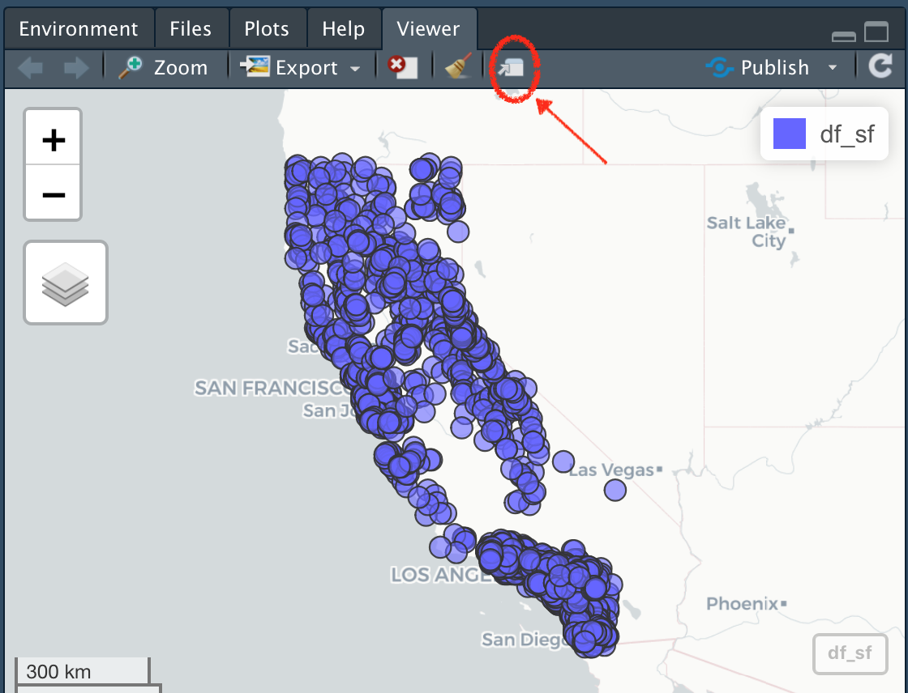
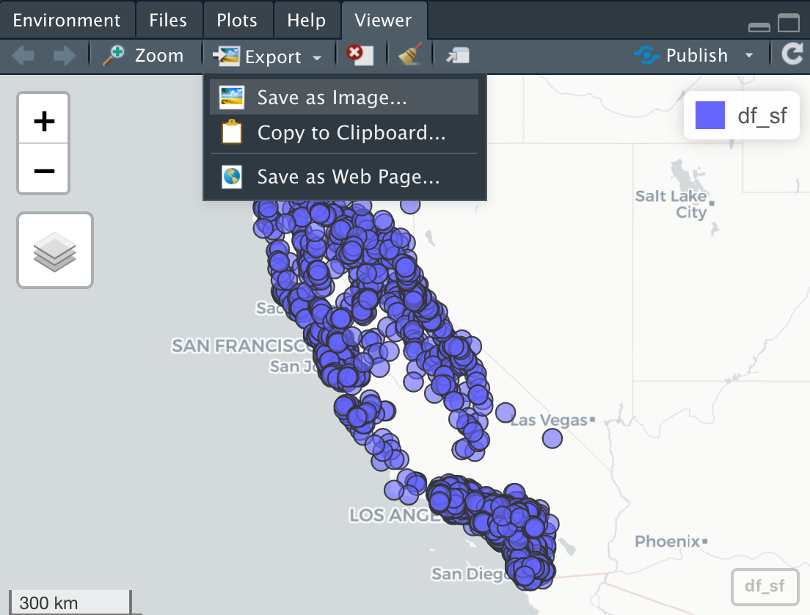

```{r setup, include=FALSE, purl=FALSE, message=FALSE}

knitr::opts_chunk$set(echo = FALSE)
library(knitr)
library(icon)
library(here)
library(flair)
suppressPackageStartupMessages(library(dplyr))

```

<style>
  .title{
    display: none;
  }
</style>

<br>
<br>

:::obj

 **Objectives for this section:**
 
 - Make dynamic interactive webmaps
 - Read in several spatial layers (`.shp`, `sf`)
 - Make a map with `ggplot` and `geom_sf`
 
:::

<br>

## Mapping In R

### **Load packages**

First let's load the packages we'll be using.

```{r installsf, echo=T, eval=F}

# install packages if you haven't already
install.packages(c("viridis", "sf","mapview", "tmap", "USAboundaries"))

# load packages or "libraries"
library(tidyverse) # wrangling/plotting tools
library(viridis) # nice color palette
library(sf) # newer "simple features" spatial package
library(mapview) # interactive web mapping
library(tmap) # static mapping
library(USAboundaries) # data for USA boundaries

```

```{r loadLibs, echo=F, warning=FALSE}
suppressPackageStartupMessages({
  library(tidyverse); # reading/writing files
  library(viridis); # nice color palette
  library(sf); # newer "simple features" spatial package
  library(mapview); # interactive web map
  library(tmap);
  library(USAboundaries)
  }) 

```

<br>

### **Load Data**

First we need to import some data. We'll be using the data we saved [from the joins lesson](m2_2_joins.html). We'll use the `data/csci_sites_match.rda` file, which since we are following the [data management/organization tips](02_project_management.html), we are in an RStudio Project, and we have a `data` folder with our data file inside! 

```{r load, echo=T, eval=T}

# Notice the relative path
load(file = "data/csci_sites_match.rda")

```

<br>

### **Convert to `{sf}` dataframe**

As in our [last lesson](m2_3_using_sf.html), let's convert our dataframe to an **{`sf`}** object.

```{r makespatial, eval=TRUE, echo=TRUE}

# make data sf object: 
df_sf <- st_as_sf(csci_sites_match,
                  coords = c("lon", "lat"), # note we put lon (or X) first!
                  remove = F, # don't remove lat/lon cols from the dataframe
                  crs = 4326) # add projection (this is WGS84)

```

<br>

## Plotting with Interactive Maps

One of the easiest and coolest packages you'll find for interactive mapping is the **`{mapview}`** package. As long as data are in an `sf` format, you can quickly make an interactive map with your data. First let's make sure we have an `sf` class of data.

```{r sfClass, echo=T, eval=T}

# check data is in sf format?
class(df_sf)

```

Next we can use the simple `mapview()` function to see a default interactive webmap! 

```{r mapview, echo=T, eval=T}
# make a map with mapview
mapview::mapview(df_sf)

```

<br>

Pretty cool! Note, we can open this in our default web browser by clicking on the little box and arrow to expand and view.

```{r expand, echo=F, eval=T, out.width='80%'}



```

<br>

### **Customizing `mapview`**

There are lots of customization options within `{mapview}`, I recommend checking the [mapview page](https://r-spatial.github.io/mapview/) to find out more. Here are a few handy tips to change the color, the size, and layer name.

```{r mapviewCustom, eval=T, echo=T}

mapview(df_sf, 
        col.regions="salmon", 
        cex=3, 
        layer.name="CSCI Sites")

```

<br>

### **Export and Save Mapview**

There a few options to do this. The best option currently is to click on the export button and save as a webpage.

```{r saveButton, eval=T, echo=F, out.width='80%'}



```

<br>
 
## Plotting with `ggplot`

Alternatively, we can use `ggplot2` instead. This is where `sf` objects are really nice. They fit well within the ggplot framework because they are simply dataframes with a spatial list-column layout. You can plot the X/Y data as part of a `geom_point` layer, or you can use the `geom_sf` function for more complex `sf` objects.

```{r GGsf, eval=T, echo=T}

nicemap<-
  ggplot() + # set up the framework
  geom_sf(data = CA, color="gray", lwd=2) + # add the state outline using geom_sf
  geom_point(data=df_sf, aes(x=New_Long, y=New_Lat), fill="orange", pch=21, alpha=0.7, size=2)+
  labs(x="Longitude (WGS84)", y="Latitude", title="Map of Points") + 
  theme_bw() # change this to sans if it doesn't plot
nicemap

# To save plot
# ggsave(filename = "./figs/site_map_ggplot.png", width = 8, height = 6, units = "in", dpi = 300)
```


**Now let's make a test map to make sure this data works/plots:**

```{r mapCounties}

ggplot() + 
  geom_sf(data=CA_counties, col="gray", alpha=0.5, lty=2) + # all counties
  geom_sf(data=sacto_co, col="purple", fill="purple2", alpha=0.8)+
  theme_bw()

```

Great, we have spatial data now for counties, and we can use this to crop our existing point data. 

### Crop points to Sacramento County

Now we want to clip our point data down to only points in Sacramento County. The quickest way to do this is using `st_intersection`.


```{r stIntersection}

# we list the thing we want to crop down first, then what we crop by second
sacto_pts <- st_intersection(df_sf, sacto_co)

plot(sacto_co$geometry)
plot(df_sf$geometry, add=T, col="gray") # all the points
plot(sacto_pts$geometry, add=T, bg ="purple", pch=21) # just the points we cropped

```


### Interactive Map!

Finally, let's make a dynamic map that shows the CSCI scores!

```{r mapviewCSCI}
mapview(sacto_pts, zcol="CSCI", layer="CSCI")

# add another layer by linking with "+"

mapview(sacto_co, layer="Sacramento County") +
  mapview(sacto_csci, zcol="CSCI", layer="CSCI")

```

### Static Map

 > **Challenge**: Can you make the same map as below using ggplot? Hint, `viridis` may be useful here...

```{r staticCSCI, eval=T, echo=FALSE}

ggplot() +
  geom_sf(data=sacto_co, col="gray", alpha=0.4, lwd=2) +
  geom_sf(data=sacto_csci, aes(fill=CSCI), pch=21, size=5) +
  scale_fill_viridis_c("CSCI") + 
  theme_bw()

```


## Saving Data Out & Getting it Back In

So we now can do a number of different things with spatial data, mapping, making a web map, cropping, etc. But a common task is saving spatial data for use in another program, or reading spatial data (i.e., typically **shapefiles**) into R.

We'll walk through how to do that with the data we've used thus far.

### Save into a shapefile

Shapefiles have been the de-facto data currency for spatial (vector-based) data for awhile. Newer more open-source formats are becoming easier to use (e.g., *geopackage*), but if you do anything spatial, you'll have to use shapefiles at some point.

Let's save one of our data layers into a shapefile. With the `sf` package, this is fairly straightforward.

```{r saveShp}

# save out as a shapefile
st_write(obj = sacto_csci, "data/sacramento_co_csci.shp", 
         delete_layer = TRUE ) # delete the existing layer if it already exists

# warnings are ok, typically associated with field widths or field names.
# commonly I get this:
# Warning messages:
# 1: In abbreviate_shapefile_names(obj) :
#   Field names abbreviated for ESRI Shapefile driver
```

How can we make sure this worked? Well we can go find the folder and check that there are 4 separate files ending with `.dbf`, `.prj`, `.shp`, and `.shx`. We can also read this data back into R and plot it to make sure it looks ok.

```{r readShp}

# select the path to the shp file
tst_shp <- st_read("data/sacramento_co_csci.shp")

plot(tst_shp$geometry)

mapview(tst_shp)

```


## Interested in Learning More?

There are loads of resources...but a geospatial workshop you may want to check out is run by the Carpentries. Lessons/material are freely available here: 

 - https://datacarpentry.org/geospatial-workshop/